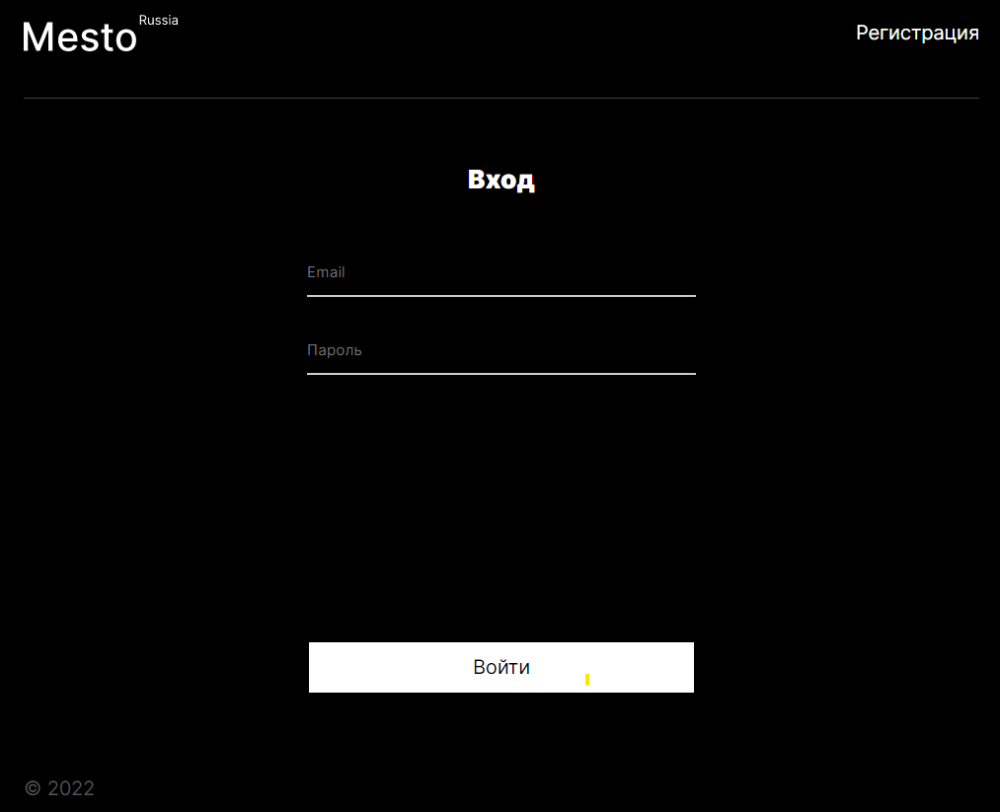
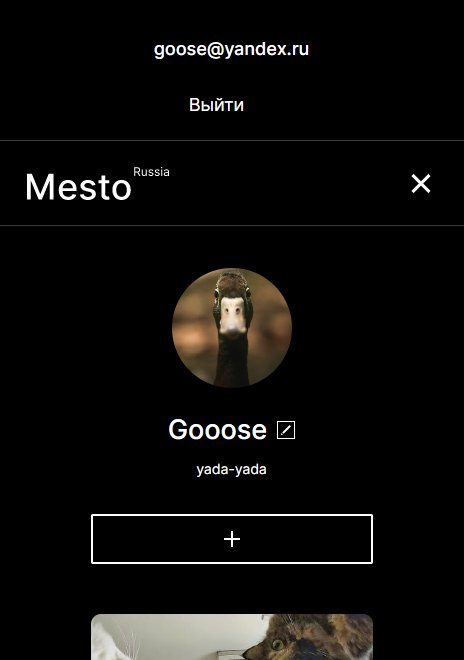
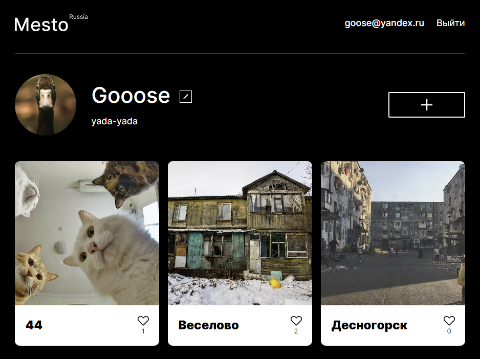
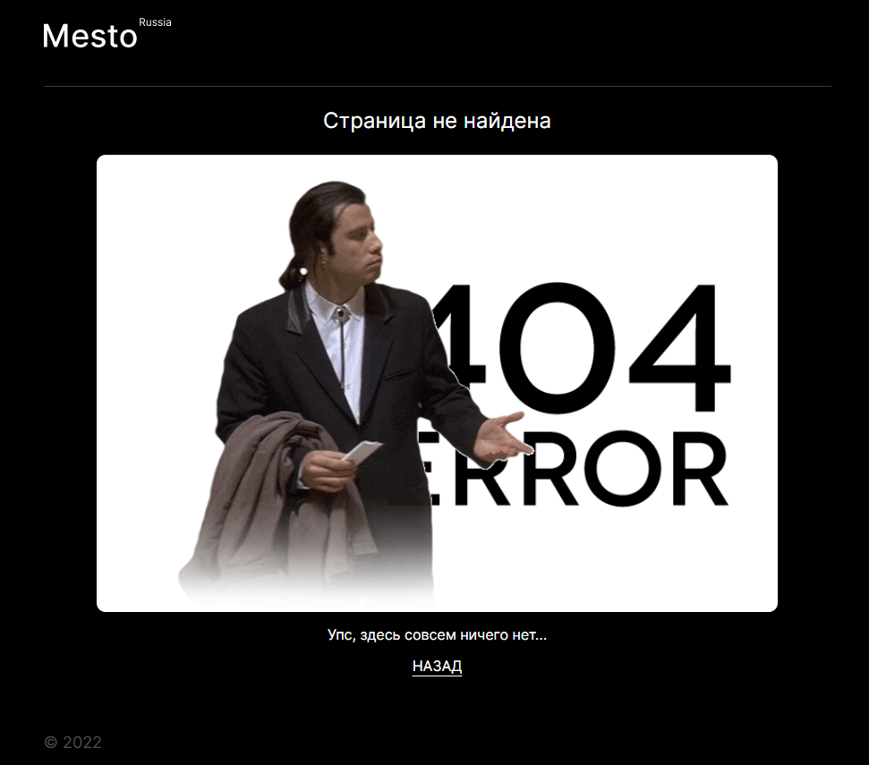

# Проект: Место (React)

### Что нового?

---

Добавлена авторизация на React в рамках 12 спринта:

Изменена структура хэдера, добавлено бургер-меню для мобильной версии:

### Функционал
- Вся функциональность приложения  доступна только авторизованным пользователям.
- / — контент для авторизованных пользователей;
- /sign-up — для регистрации пользователя;
  /sign-in — для авторизации пользователя;
- PageNotFound — заглушка для ошибки 404;
- NoInternetConnection — проверка подключения. Если интернет не доступен, всплывает попап с 
  уведомлением.
- Токен сохраняется в Local Storage и удаляется из него при нажатии на кнопку (выйти)
---

### **Как посмотреть**
- Склонируйте проект по HTTPS https://github.com/julbrn/react-mesto-auth.git или через SSH: git@github.com:julbrn/react-mesto-auth.git;
- Перейдите в папку проекта;
- Установите зависимости npm install;
- Используйте npm start для запуска проекта на 
  локальном сервере по адресу http://localhost:3000;
---
- [Ссылка на репозиторий на предыдущую версию проекта без авторизации](https://github.com/julbrn/mesto-react)
- [Ссылка на проект на **GitHub Pages**](https://julbrn.github.io/react-mesto-auth/)
